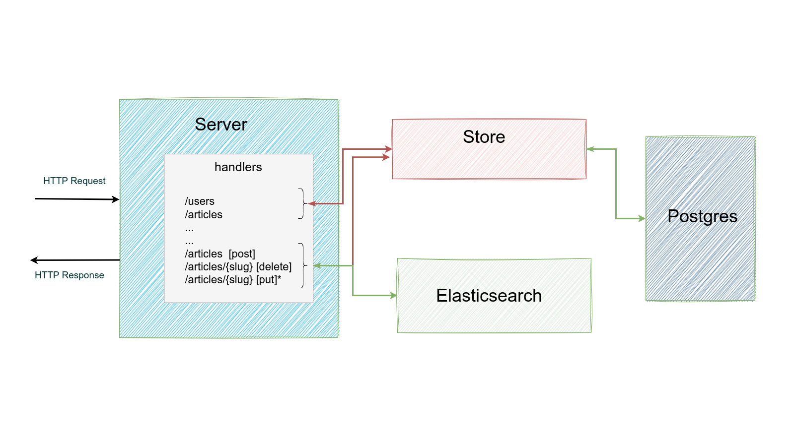

# 

> ### Golang/Gin codebase containing real world examples (CRUD, auth, advanced patterns, etc) that adheres to the [RealWorld](https://github.com/gothinkster/realworld) spec and API.


### [Demo](https://demo.realworld.io/)&nbsp;&nbsp;&nbsp;&nbsp;[RealWorld](https://github.com/gothinkster/realworld)


This codebase was created to demonstrate a fully fledged fullstack application built with **Golang/Gin** including CRUD operations, authentication, routing, pagination, and more.


# How it works
 
* The project uses:
    * [gin-gonic/gin](https://github.com/gin-gonic/gin) as the web framework
    * [jackc/pgx](https://github.com/jackc/pgx) as the database driver
    * [kyleconroy/sqlc](https://github.com/kyleconroy/sqlc) to generate Go code from SQL queries
    * [golang-migrate/migrate](https://github.com/golang-migrate/migrate) to manage database migrations
    * [golang-jwt/jwt](https://github.com/golang-jwt/jwt) for authentication
    * [zap](https://github.com/uber-go/zap) for logging
    * [spf13/viper](https://github.com/spf13/viper) for configuration
    * [rs/xid](https://github.com/rs/xid) for generating UUIDs
    * [stretchr/testify](https://github.com/stretchr/testify) for testing
    * [golang/mock](https://github.com/golang/mock) for mocking dependencies 
    * [swaggo/swag](https://github.com/swaggo/swag) for API documentation
* Also uses:
    * *PostgreSQL* for the database
    * *Elasticsearch* for the search engine (optional, to be implemented)
# Getting started 
Running the project locally:

```
    docker-compose up -d // starts postgres container
    go run main.go
```

Project starts on port 8085 by default and swagger documentation is available at [http://localhost:8085/swagger/index.html](http://localhost:8085/swagger/index.html). 

# e2e testing
First, run:
```
   make test-run 
```
This will start postgres container and the project itself. Then, run the tests with:
```
    make e2e-test
```

# unit testing
```
    make unit-test
```

# TODO
* [x] Add unit tests for handlers (... in progress)
* [ ] Improve error handling and logging
* [x] Improve deployment and testing configuration (Makefile, docker-compose, etc.) ( ... in progress)
* [ ] Add search feature (`/search`, ...)
