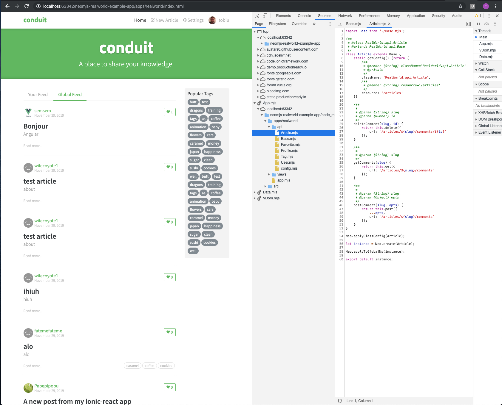
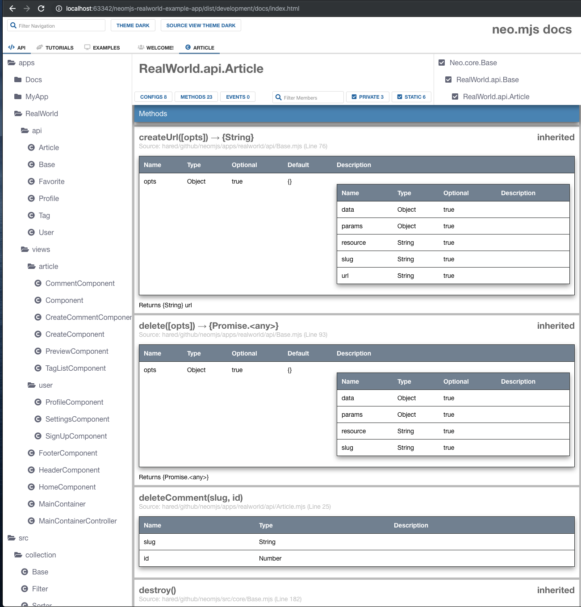
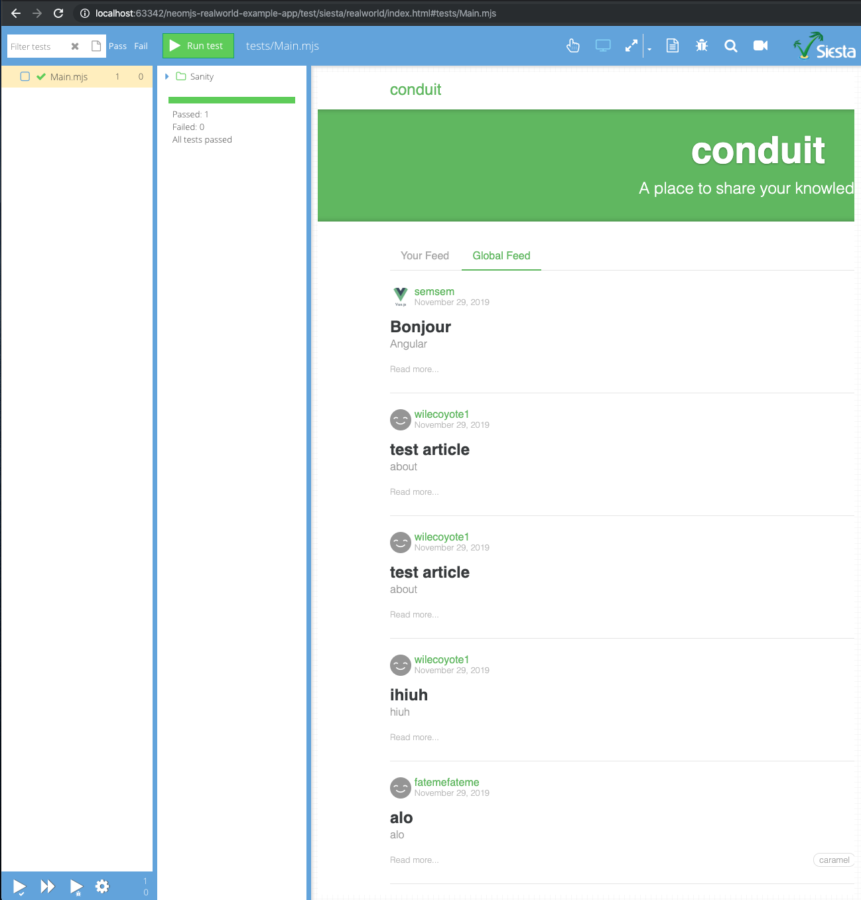

# 

> ### neo.mjs codebase containing real world examples (CRUD, auth, advanced patterns, etc) that adheres to the [RealWorld](https://github.com/gothinkster/realworld) spec and API.

### [Demo](https://neomjs.github.io/neomjs-realworld-example-app/)&nbsp;&nbsp;&nbsp;&nbsp;[RealWorld](https://github.com/gothinkster/realworld)

This codebase was created to demonstrate a fully fledged fullstack application built with **neo.mjs** including CRUD operations, authentication, routing, pagination, and more.

We've gone to great lengths to adhere to the **neo.mjs** community styleguides & best practices.

For more information on how to this works with other frontends/backends, head over to the [RealWorld](https://github.com/gothinkster/realworld) repo.

# How it works

<a href="https://github.com/neomjs/neo">neo.mjs</a> is a webworkers driven UI framework.

Meaning: most parts of the framework as well as the apps which you create with it will run inside a separate thread.

You get the best experience in Chrome, using the following browser flag:

> chrome://flags/#enable-experimental-web-platform-features

(copy the link into a new browser tab)

With this feature, it is already possible to import JS modules as they are into webworkers

1.  You get the real code and an unmatched debugging experience (you don't even need source-maps)
2.  This increases the development speed, since you don't need any JS builds
3.  We strongly believe this is the future of crafting web based UIs

If you look close at the console, you will see:
1.  The real world app code running inside the App.mjs thread
2.  A JS module as it is

neo.mjs has a documentation engine based on JSDoc
1.  The docs app UI is a neo.mjs app as well
2.  You get documentation views for your own neo.mjs apps out of the box

neo.mjs is using the Bryntum testing suite <a href="https://www.bryntum.com/products/siesta/">Siesta</a> for unit and UI testing

# Getting started

> npm install

> npm run server-start

The server will throw 2 errors which you can ignore for now.

A new default browser (hopefully Chrome) tab should open right away

You will get an index starting page from which one you can enter the different app versions.

# Build processes
In case you want to change the code of this app, all changes will get applied to the non dist version
without the need for a build.

In case you want to apply your changes to the dist versions:

> npm run dev-build-my-apps

> npm run prod-build-my-apps