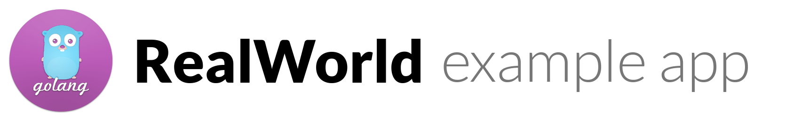

# 

> ### Go codebase containing real world examples (CRUD, auth, advanced patterns, etc) that adheres to the [RealWorld](https://github.com/gothinkster/realworld-example-apps) spec and API.


### [Demo]()&nbsp;&nbsp;&nbsp;&nbsp;[RealWorld](https://github.com/gothinkster/realworld)


This codebase was created to demonstrate a fully fledged fullstack application built with **Go** including CRUD operations, authentication, routing, pagination, and more.

We've gone to great lengths to adhere to the **Go** community styleguides & best practices.

For more information on how to this works with other frontends/backends, head over to the [RealWorld](https://github.com/gothinkster/realworld) repo.


# How it works

> Describe the general architecture of your app here

# Getting started

### Installing and setting up Go 
- Installation instructions for Go: [Getting Started](https://golang.org/doc/install)
- Getting familiar with the environment: [How to write Go Code](https://golang.org/doc/code.html)

### Getting the Project
```
go get github.com/JackyChiu/realworld-starter-kit
cd $GOPATH/src/github.com/JackyChiu/realworld-starter-kit
```

### Building and Running
```
go build
./realworld-starter-kit
```

### Testing 
```
go test
# -v for verbose
```

# Contributing 
- Comment one which issue you'd like to do
- Fork the project then get the project: [Getting the project](#getting-the-project)
- Now you have your own project URL (from your fork)

```
git remote rename origin upstream
git remote add origin {YOUR_URL}
```

After changes make a PR!
