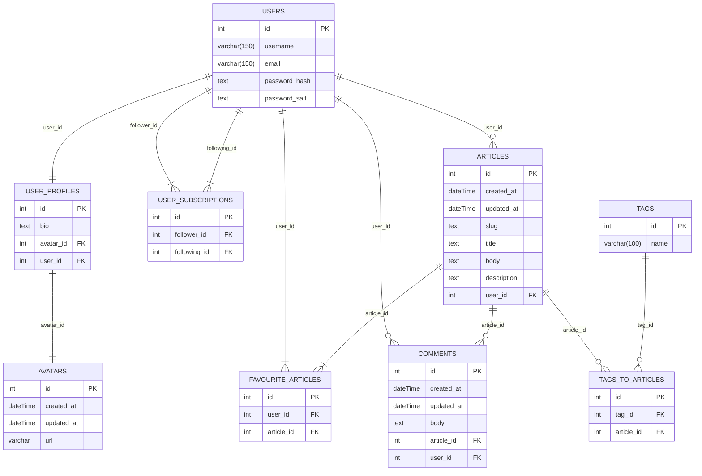

# Conduit

# Description

Fullstack clone of medium.com.

# How it works

To be added

```mermaid

erDiagram
  USERS {
    int id PK
    varchar(150) username
    varchar(150) email
    text password_hash
    text password_salt
  }

  USER_PROFILES {
    int id PK
    text bio
    int avatar_id FK
    int user_id FK
  }

  AVATARS {
    int id PK
    dateTime created_at
    dateTime updated_at
    varchar url
 }

 USER_SUBSCRIPTIONS {
    int id PK
    int follower_id FK
    int following_id FK
 }

 ARTICLES {
    int id PK
    dateTime created_at
    dateTime updated_at
    text slug
    text title
    text body
    text description
    int user_id FK
 }

 FAVOURITE_ARTICLES {
    int id PK
    int user_id FK
    int article_id FK
 }

 COMMENTS {
    int id PK
    dateTime created_at
    dateTime updated_at
    text body
    int article_id FK
    int user_id FK
 }

 TAGS {
    int id PK
    varchar(100) name
 }

 TAGS_TO_ARTICLES {
    int id PK
    int tag_id FK
    int article_id FK
 }

  USERS ||--|| USER_PROFILES : user_id
  USER_PROFILES ||--|| AVATARS : avatar_id
  USERS ||--|{ USER_SUBSCRIPTIONS : follower_id
  USERS ||--|{ USER_SUBSCRIPTIONS : following_id
  USERS ||--|{ FAVOURITE_ARTICLES : user_id
  USERS ||--o{ ARTICLES : user_id
  USERS ||--o{ COMMENTS : user_id
  ARTICLES ||--|{ FAVOURITE_ARTICLES : article_id 
  ARTICLES ||--o{ COMMENTS : article_id
  ARTICLES ||--o{ TAGS_TO_ARTICLES : article_id
  TAGS ||--o{ TAGS_TO_ARTICLES : tag_id

```

# Getting started

To be added

